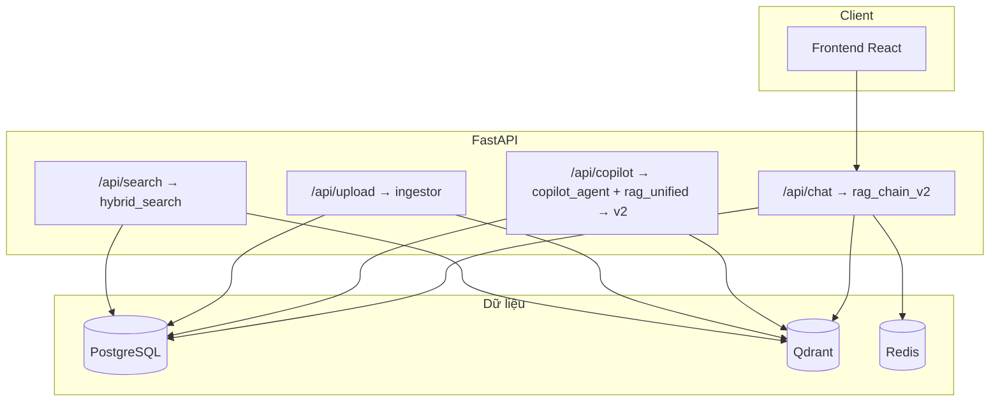
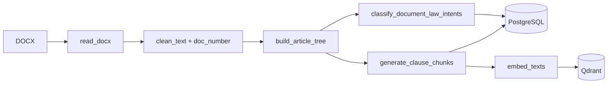
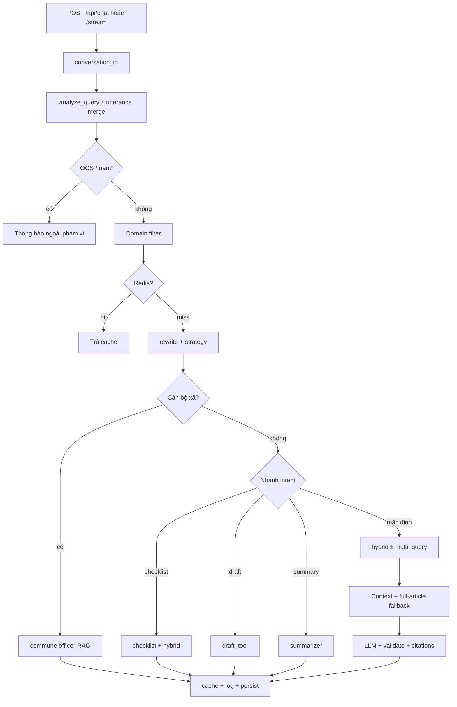
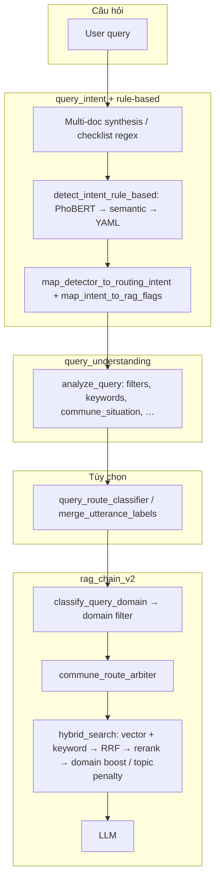
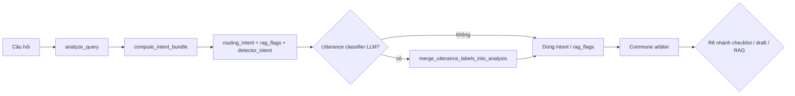

# Government AI Copilot — Trợ lý hành chính & RAG văn bản pháp luật

Hệ thống **RAG production** cho cán bộ VHXH: **PostgreSQL** (metadata + full-text `articles`), **Qdrant** (vector), **Redis** (cache), **hybrid retrieval** (semantic + FTS/ILIKE → RRF → rerank), **OpenAI API** cho LLM. Giao diện web tiếng Việt (React/Vite); API `**/api/chat`** / `**/api/chat/stream`** là đường chính — `**rag_chain_v2`**. Stream hiện tại là **pseudo-stream** (chia nhỏ câu trả lời sau khi LLM xong), không stream token trực tiếp từ OpenAI.

- **API:** FastAPI `Government AI Copilot API`, version `2.0.0`
- **Module SQLite/FAISS/langchain v1:** đã gỡ; chỉ còn stack async v2

---

## Kiến trúc đang dùng (tóm tắt)




| Thành phần                      | Vai trò                                                                                                                                                                                                                                                                                                                                                                                                                                                                     |
| ------------------------------- | --------------------------------------------------------------------------------------------------------------------------------------------------------------------------------------------------------------------------------------------------------------------------------------------------------------------------------------------------------------------------------------------------------------------------------------------------------------------------- |
| **Frontend**                    | React 18 + Vite + Tailwind; gọi `**/api/chat/stream`** (body: `question`, `temperature`, tuỳ chọn `conversation_id`)                                                                                                                                                                                                                                                                                                                                                        |
| `**rag_chain_v2`**              | Pipeline chat production: `conversation_id` → `analyze_query` → OOS → domain + Redis cache → **(cache miss)** `rewrite_query` + `extract_query_features` / `strategy_router` → commune arbiter → checklist / draft / summary **hoặc** `hybrid_search` ± `_multi_query_retrieve` (theo `rag_flags` + strategy) → neo chủ đề / full-article → LLM → `validate_article_completeness` + chống ảo + `validate_answer` (LLM) — checklist/commune dùng `retrieval_query` đã rewrite; không chèn danh sách văn bản CSDL vào body |
| `**query_rewriter.py**`         | Viết lại câu hỏi tiếng Việt trang trọng cho retrieval (sau cache miss; bỏ qua khi `document_drafting` / `document_summary`).                                                                                                                                                                                                                                                                                                                                                |
| `**query_features.py**`         | Regex/feature: `Điều`, khoản, số văn bản, procedure, so sánh, giải thích, độ dài câu, …                                                                                                                                                                                                                                                                                                                                                                                     |
| `**strategy_router.py**`        | `compute_strategy_scores` → `select_strategies` (`lookup` / `semantic` / `multi_query`) — bổ sung cho `rag_flags`, không thay thế `analyze_query`.                                                                                                                                                                                                                                                                                                                          |
| `**answer_validator.py**`       | Thêm `validate_answer` (LLM JSON): groundedness; giữ `validate_answer_grounding` (embedding) và `validate_article_completeness`.                                                                                                                                                                                                                                                                                                                                            |
| `**rag_unified.py**`            | Bọc `**rag_chain_v2.rag_query**` cho Copilot: chuẩn hóa `sources` (content/metadata), stream tương thích SSE cũ                                                                                                                                                                                                                                                                                                                                                             |
| `**rag_chain.py**`              | Hàm tiện ích dùng bởi v2/Copilot: `**_fallback_reasoning**`, `**strip_hallucinated_references**`, checklist helpers; `**rag_query**` / `**rag_query_stream**` là pipeline retrieval cũ trong cùng file — **không** mount qua router (chat chính dùng v2)                                                                                                                                                                                                                    |
| `**query_route_classifier.py`** | LLM JSON (`response_format: json_object`): pháp lý vs web, checklist vs nội dung, tham chiếu hội thoại — bổ sung/override sau `analyze_query`                                                                                                                                                                                                                                                                                                                               |
| `**copilot_agent`**             | `detect_intent` → (tuỳ intent) `route_query` hoặc `rag_query_unified` + `conversation_id`; có thể có `classify_user_utterance` khi bật classifier                                                                                                                                                                                                                                                                                                                           |
| **Ingest**                      | `.doc`/`.docx` → parse → chunk theo Điều/Khoản → embed → PostgreSQL + Qdrant                                                                                                                                                                                                                                                                                                                                                                                                |
| **Retrieval**                   | `hybrid_retriever`: vector + keyword (FTS `articles` + fallback ILIKE) → RRF → **FlagReranker** (fallback CrossEncoder) → diversify / cap article                                                                                                                                                                                                                                                                                                                           |


### Tech stack (tham chiếu)


| Lớp               | Công nghệ                                                                                               |
| ----------------- | ------------------------------------------------------------------------------------------------------- |
| Frontend          | React 18, Vite, Tailwind, react-markdown                                                                |
| Backend           | FastAPI, Uvicorn, SQLAlchemy async + asyncpg, Alembic                                                   |
| LLM               | OpenAI API (hoặc tương thích qua `OPENAI_BASE_URL`)                                                     |
| Embedding         | sentence-transformers (`keepitreal/vietnamese-sbert`, 768-d)                                            |
| Intent (optional) | `transformers` + PhoBERT fine-tuned cục bộ (`backend/app/intent_model`, bật/tắt `INTENT_MODEL_ENABLED`) |
| Rerank            | FlagEmbedding `FlagReranker` → fallback CrossEncoder                                                    |
| Vector            | Qdrant; Cache: Redis                                                                                    |


---

## Pipeline hệ thống — phân tích chi tiết

Phần này bám **mã nguồn** trong `backend/app` (FastAPI + pipeline ingest + `rag_chain_v2`). Hai trục chính: **đưa văn bản vào kho** (PostgreSQL + Qdrant) và **trả lời câu hỏi** (hybrid retrieval + LLM).

### 1. Ingestion — từ DOCX đến DB và vector

**Điểm vào:** `pipeline/ingestor.py` → `ingest_document()` (thường qua `routers/document_router_v2` upload).

| Bước | Giai đoạn | Module / hàm | Nội dung |
|------|-----------|--------------|----------|
| 1 | Parse | `parser/docx_parser.read_docx` | Trích văn bản từ DOCX |
| 2 | Làm sạch + số hiệu | `pipeline/cleaner.clean_text`, regex trong `ingestor` | Chuẩn hóa text, suy ra `doc_number` từ tên file / phần đầu văn bản |
| 3 | Cấu trúc pháp luật | `pipeline/legal_parser.build_article_tree` | Cây **Điều / Khoản**; không phát hiện Điều → ingest hủy |
| 3b | Gán nhãn chủ đề văn bản | `domain_classifier.classify_document_law_intents` | Đa nhãn `law_intents` (cùng từ vựng miền pháp lý); `legal_domain` = phần tử đầu — lưu PostgreSQL và payload Qdrant |
| 4 | Bản ghi tài liệu | `pipeline/db_writer.insert_document` | Bảng `documents` (metadata, `law_intents` JSON, …) |
| 5 | Chuẩn hóa quan hệ | `insert_chapters`, `insert_sections_from_articles`, `insert_articles`, `insert_clauses` | Thứ bậc chương / mục / điều / khoản trong PG |
| 6 | Chunk cho RAG | `pipeline/chunk_generator.generate_clause_chunks` | Chunk theo khoản, gắn metadata điều, tiêu đề, số văn bản |
| 7 | Embedding | `pipeline/embedding.embed_texts` | Mô hình sentence-transformers (768 chiều, cấu hình trong `config`) |
| 8 | Vector store | `pipeline/vector_store.upsert_vectors` | Ghi Qdrant kèm payload (`doc_number`, `legal_domain`, `law_intents`, `article_number`, …) |
| 9 | Đồng bộ chunk PG | `insert_chunks` | Bảng `vector_chunks`, giữ `vector_id` khớp Qdrant |



### 2. Hybrid retrieval — bên trong `hybrid_search`

**File:** `retrieval/hybrid_retriever.py` → `hybrid_search()`.

- **Vector:** `vector_retriever.vector_search` — Qdrant, có lọc `legal_domains`, `doc_number` khi có.
- **Keyword:** `keyword_retriever.keyword_search` — ưu tiên FTS trên `articles.search_vector` (PostgreSQL), lỗi/thiếu chỉ mục thì fallback ILIKE trên `vector_chunks`.
- **Gộp thứ hạng:** RRF giữa hai nguồn; có nhánh **lookup Điều / văn bản** trực tiếp từ DB khi truy vấn mang mốc rõ (số hiệu, Điều).
- **Rerank:** `reranker.rerank` — FlagReranker, fallback CrossEncoder.
- **Sau rerank:** điều chỉnh điểm theo khớp `legal_domain` / `law_intents` với domain câu hỏi, penalty chủ đề lệch (`TOPIC_MISMATCH_PENALTY`), `diversify_by_article` và `dynamic_max_articles`. Văn bản **sửa đổi, bổ sung** có nhánh mở rộng lấy thêm Điều (cấu hình `RAG_AMENDMENT_*`).

### 3. Chat production — `rag_chain_v2.rag_query` / `rag_query_stream`

**HTTP:** `routers/chat_router.py` — `POST /api/chat` và `POST /api/chat/stream`. `ChatRequest` chấp nhận `query` hoặc `question` (frontend thường gửi `question`).

**Stream:** `rag_query_stream` dùng hàng đợi nội bộ: phát **meta** (gồm `conversation_id`), **sources**, các **chunk văn bản** từ generator LLM, rồi **text_finalize** — tức là *pseudo-stream* sau khi có luồng token từ LLM client, không phải SSE trực tiếp từ API nhà cung cấp theo từng token thuần.

Thứ tự xử lý chính trong `rag_query` (khớp code hiện tại):

1. **Hội thoại:** dùng lại `conversation_id` hoặc tạo mới; cuối luồng ghi user/assistant qua `conversation_repository`.
2. **`analyze_query`:** `query_understanding` gọi `compute_intent_bundle` → `intent` (chính là `routing_intent`), `detector_intent`, `rag_flags`, filter/từ khóa, `commune_situation`, … Nếu bật classifier: `classify_user_utterance` + `merge_utterance_labels_into_analysis`.
3. **Out of scope:** `detector_intent == nan` hoặc `intent == out_of_scope` → thông điệp cố định, **không** rewrite, không retrieval.
4. **Miền pháp lý:** `get_domain_filter_values` + (khi có filter) `classify_query_domain` — log và truyền xuống retrieval.
5. **Redis:** cache theo **câu gốc**; **không** cache nhánh `checklist_documents`, `document_drafting`, `document_summary`.
6. **Sau cache miss:** `rewrite_query` (trừ draft/summary) → `extract_query_features` → `compute_strategy_scores` → `select_strategies`.
7. **Cán bộ xã:** `resolve_use_commune_officer_pipeline` — nếu đúng → `_answer_commune_officer_query` (retrieval dùng `retrieval_query` đã rewrite), rồi cache/log/return.
8. **`checklist_documents`:** `_answer_checklist_query` (hybrid + LLM, `retrieval_query` đã rewrite).
9. **`document_drafting`:** `_answer_drafting_query` → `draft_tool`.
10. **`document_summary`:** `document_summarizer.summarize_matched_document`.
11. **RAG mặc định:**  
    - Gợi ý multi-query: probe `vector_search` + `rag_flags` + `should_expand_query_v2` + strategy có `STRATEGY_MULTI_QUERY`.  
    - `hybrid_search` rộng → tuỳ cờ gọi thêm `_multi_query_retrieve`, `dedup_chunks`, sắp theo `rerank_score` / `rrf_score`.  
    - Nếu user trích dẫn số văn bản rõ: lọc passage khớp `_passages_match_explicit_doc_ref`.  
    - **Neo chủ đề:** retry `hybrid_search` khi anchor chủ thể / từ khóa chủ đề không khớp ngữ cảnh (trừ khi có số hiệu rõ).  
    - **Trống kết quả:** thử hybrid “nới” (bỏ domain) cho câu thủ tục hoặc có số văn bản.  
    - Câu điều kiện đăng ký / phạm vi pháp lý rộng: `_fallback_full_article_retrieval`.  
    - Ghép ngữ cảnh: một văn bản/điều vs `group_chunks_by_article` + `format_grouped_context`; câu chỉ hỏi “văn bản nào” có thể trả lời deterministik không qua LLM.
12. **LLM:** `_build_rag_user_prompt` + `SYSTEM_PROMPT_V2`; có history thì `generate_with_messages` / `generate_with_messages_stream`, không thì `generate` / `generate_stream`.
13. **Hậu xử lý:** `sanitize_rag_llm_output`, retry nếu model trả “không có thông tin” nhưng vẫn có passage; chỉnh riêng khi câu hỏi **mức phạt** nhưng ngữ cảnh là **thẩm quyền** (`query_asks_fine_amount` + `context_describes_authority`).
14. **`validate_article_completeness`:** thiếu khoản trong Điều → retrieve full điều và regenerate.
15. **Chống ảo:** so khớp Điều bắt buộc (khi câu hỏi yêu cầu), `strip_answer_lines_with_hallucinated_doc_numbers`, `_build_related_documents_fallback` khi cần.
16. **`validate_answer` (LLM):** groundedness; fail → prompt nghiêm + regenerate hoặc `get_fallback_answer`.
17. **`_ensure_legal_citations`**, guard bắt buộc có cặp Điều–nội dung cho một số intent pháp lý.
18. **Độ tin cậy thấp:** có thể retry đường multi-article; vẫn thấp có thể gọi `_fallback_reasoning` từ `rag_chain`.
19. **`_append_followup_prompts`**, ghi Redis, `log_interaction`, lưu turn hội thoại.



### 4. Lớp Copilot (`agents/copilot_agent`)

Luồng **không** thay thế `analyze_query` trên `/api/chat`; Copilot gọi `detect_intent` (async: guard, PhoBERT nếu bật, prototype, YAML, có thể LLM), kiểm tra `is_in_document_domain`, rồi hoặc **`route_query`** (intent chuyên biệt: thủ tục, soạn thảo, trích xuất, …) hoặc **`rag_query_unified`** / stream — bên trong vẫn là `rag_chain_v2`.

---

## Phiên bản schema & hành vi gần đây


| Chủ đề                                | Nội dung                                                                                                                                                                                                                                                                                                                                                       |
| ------------------------------------- | -------------------------------------------------------------------------------------------------------------------------------------------------------------------------------------------------------------------------------------------------------------------------------------------------------------------------------------------------------------- |
| **Alembic**                           | Chuỗi migration: `v3_001` (extension `unaccent`, `pg_trgm`, cột generated `articles.search_vector` + GIN), `v3_002`/`v3_003` (TEXT documents), `004_chat_conv` (hội thoại), `005_law_intents` (JSON `documents.law_intents`). Chạy `alembic upgrade head` trong `backend/`.                                                                                    |
| **FTS / keyword**                     | Ưu tiên FTS trên `articles.search_vector` (trong `begin_nested` savepoint); lỗi/thiếu cột → cảnh báo và ILIKE trên `vector_chunks`.                                                                                                                                                                                                                            |
| **Domain (truy vấn)**                 | `domain_classifier.classify_query_domain` → `get_domain_filter_values` trong `rag_chain_v2` → tiền lọc Qdrant theo `legal_domain`.                                                                                                                                                                                                                             |
| **Nhãn theo văn bản (`law_intents`)** | Ingest: `classify_document_law_intents(title, trích yếu/đoạn đầu)` — đa nhãn cùng từ vựng `LEGAL_DOMAINS`; lưu DB + payload Qdrant; `legal_domain` = phần tử đầu.                                                                                                                                                                                              |
| **Hybrid / rerank**                   | Sau rerank: boost nếu `legal_domain` ∈ domain filter; post-filter domain mềm (không trả rỗng khi metadata lệch); **phạt chủ đề** (`TOPIC_MISMATCH_PENALTY`) khi domain câu hỏi không giao với `law_intents`/`legal_domain` — bỏ qua khi user chỉ rõ số hiệu văn bản. Enrich DB: nếu thiếu cột `law_intents`, retry không chọn cột + `rollback()` (PostgreSQL). |
| **Article selection**                 | `article_selection.py`: `diversify_by_article`, `dynamic_max_articles` (sau rerank trong `hybrid_retriever`).                                                                                                                                                                                                                                                  |
| **Commune route arbiter**             | `commune_route_arbiter.py`: cosine prototype “thủ tục cấp xã” vs “tra cứu pháp lý”; nếu                                                                                                                                                                                                                                                                        |
| `**query_intent`**                    | `compute_intent_bundle`: regex đa văn bản / checklist + `detect_intent_rule_based` (**PhoBERT → semantic prototype → structural YAML**) + `map_intent_to_rag_flags`; LLM `merge_utterance_labels_into_analysis` khi bật `QUERY_UTTERANCE_CLASSIFIER_ENABLED`.                                                                                                  |
| **Intent async (`detect_intent`)**    | Guard → PhoBERT → semantic → structural YAML → LLM zero-shot (xem `intent_detector.py`). Khác `detect_intent_rule_based` (không LLM).                                                                                                                                                                                                                          |
| **Cấu hình pattern**                  | `intent_patterns/routing.yaml`: `structural_rules` (regex + `intent_id`), nhóm `routing` (multi-doc synthesis, checklist, …), `prototype_sentences` tùy chọn; nạp qua `intent_pattern_config.load_intent_pattern_config()` ở startup.                                                                                                                          |
| **Tra cứu vs stub đa nguồn**          | `query_expects_llm_synthesis_from_context` (`query_text_patterns`) → không dùng `_build_multi_source_answer` kiểu liệt kê; prompt thêm khối **trả lời trực tiếp** khi cần.                                                                                                                                                                                     |
| `**query_text_patterns` (mở rộng)**   | `query_asks_structured_registration_conditions` — điều kiện đăng ký/thành lập/hoạt động: prompt bắt **trích nguyên văn đủ khoản** trước, sau đó tóm nhóm CSVC / hoạt động / nhân lực. `query_asks_comprehensive_statutory_coverage` — chính sách NN, tiêu chí phân loại dự án trọng điểm: prompt **quét đủ Điều** trong ngữ cảnh cùng chủ đề.                  |
| **Cờ RAG bổ sung (`query_intent`)**   | Sau `map_intent_to_rag_flags`: `_force_multi_article_for_comprehensive_statutory_queries` bật `needs_expansion` + `use_multi_article` cho *chính sách nhà nước*, *tiêu chí + phân loại/trọng điểm*, *thư viện công* + (là gì / điều kiện).                                                                                                                     |
| `**routing.yaml`**                    | Nhóm `substantive_expansion` và `multi_article_boost_substantive` bổ sung pattern *chính sách… nhà nước*, *tiêu chí… phân loại/dự án*, *dự án trọng điểm quốc gia*.                                                                                                                                                                                            |
| **Định dạng câu trả lời RAG**         | Không còn chèn tự động danh sách “Các văn bản pháp luật liên quan trong cơ sở dữ liệu hiện có”; `RAG_PROMPT_TEMPLATE_V2` / `RAG_PROMPT_TEMPLATE` hướng dẫn ghi văn bản trong **Căn cứ pháp lý** hoặc gắn với đoạn trích. Fallback “chỉ có tên văn bản” (`_build_related_documents_fallback`) vẫn dùng khi không có nội dung chi tiết.                          |
| `**MULTI_ARTICLE_MAX_ARTICLES`**      | Mặc định **8** (trước 5); chỉnh qua biến môi trường nếu cần.                                                                                                                                                                                                                                                                                                   |
| **UX**                                | Căn cứ pháp lý gom theo văn bản; follow-up cuối câu theo ngưỡng độ tin cậy.                                                                                                                                                                                                                                                                                    |
| **Lưu file**                          | Upload vào `backend/app/storage/<id>/` (thư mục **gitignore**).                                                                                                                                                                                                                                                                                                |


---

## Khởi động backend (`main.py` — thứ tự thực tế)

1. `init_postgres()`
2. `warmup_embeddings()`
3. `warmup_commune_route_index()`
4. `ensure_collection()` (Qdrant)
5. `warmup_reranker()`
6. `load_intent_pattern_config()` — nạp `intent_patterns/routing.yaml` (structural + routing + prototype)
7. `warmup_intent_index()` (prototype cosine cho intent)
8. `warmup_intent_classifier()` (PhoBERT trong `app/intent_model`; bỏ qua an toàn nếu tắt hoặc thiếu `transformers`/weights)
9. `warmup_domain_index()`
10. Shutdown: `close_postgres()`

---

## Luồng chat production: `POST /api/chat` & `/api/chat/stream`

Bảng dưới là **bản tóm tắt**; mô tả từng bước và sơ đồ đầy đủ nằm ở [Pipeline hệ thống — phân tích chi tiết](#pipeline-hệ-thống--phân-tích-chi-tiết) (§3).

**Router:** `app/routers/chat_router.py` → `**rag_query`** / `**rag_query_stream`**.

`**ChatRequest`:** nhận `query` hoặc `question` (frontend dùng `question`); tuỳ chọn `conversation_id`, `doc_number`, `temperature`.


| Bước | Việc xảy ra                                                                                                                                                                                       |
| ---- | ------------------------------------------------------------------------------------------------------------------------------------------------------------------------------------------------- |
| 0    | `conversation_id` (tái sử dụng hoặc tạo mới); lưu turn qua `conversation_repository`                                                                                                               |
| 1    | `analyze_query` → `intent` (= `routing_intent`), `rag_flags`, `commune_situation`; (tuỳ cấu hình) `merge_utterance_labels_into_analysis` — xem **Intent & cờ RAG** và mục **Pipeline chi tiết §3** |
| 2    | **Out of scope:** `detector_intent == nan` hoặc `intent == out_of_scope` → thông điệp cố định, **không** rewrite / retrieval                                                                        |
| 3    | Lọc miền pháp lý: `get_domain_filter_values` + `classify_query_domain` (khi có filter)                                                                                                             |
| 4    | Redis cache theo **câu gốc** (bỏ qua checklist / draft / summary)                                                                                                                                  |
| 5    | **Sau cache miss:** `rewrite_query` (LLM, trừ draft/summary) → `extract_query_features` + `compute_strategy_scores` + `select_strategies`                                                         |
| 6    | `resolve_use_commune_officer_pipeline` → `_answer_commune_officer_query(..., retrieval_query=rewritten)` nếu true                                                                               |
| 7    | `checklist_documents` / `document_drafting` / `document_summary` (checklist dùng `retrieval_query` đã rewrite)                                                                                     |
| 8    | Nhánh RAG mặc định: `hybrid_search` broad ± `_multi_query_retrieve` (cộng hưởng `rag_flags`, `should_expand_query_v2`, `STRATEGY_MULTI_QUERY`); dedup/sort; lọc số văn bản nếu user trích dẫn rõ     |
| 9    | **Neo chủ đề:** retry `hybrid_search` khi anchor/topic lệch; `_fallback_full_article_retrieval` cho điều kiện đăng ký / phạm vi pháp lý rộng (xem `query_text_patterns.py`)                       |
| 10   | Ghép context (một điều/văn bản hoặc `group_chunks_by_article`); LLM `_build_rag_user_prompt` + `SYSTEM_PROMPT_V2` (user message vẫn dùng **câu gốc** `query`)                                      |
| 11   | Hậu xử lý: sanitize, retry no-info, chỉnh mức phạt vs thẩm quyền; `validate_article_completeness`; chống ảo số hiệu/Điều; `validate_answer` (LLM) nếu có key; `_ensure_legal_citations`; retry độ tin cậy / `_fallback_reasoning`; follow-up |


**Ghi chú Copilot / `query_router`:** nhánh `_handle_commune_level` cũng gọi `rewrite_query` rồi truyền `retrieval_query` vào `_answer_commune_officer_query` để đồng bộ với chat chính.

---

## Pipeline v2 — EDA trên `data_clean.json` (100 câu, seed 42)

Script đánh giá **offline** (không DB, không OpenAI): `compute_intent_bundle` + `extract_query_features` + `strategy_router` trên mẫu ngẫu nhiên từ `data_clean.json` (JSONL: `question`, `intent` gold).

### Chạy lại

```bash
cd backend
python scripts/eda_pipeline_data_clean.py --n 100 --seed 42
```

Mặc định `INTENT_MODEL_ENABLED=false` (rule-based + prototype, không PhoBERT).

### Output

- `backend/tests/evaluation/results/pipeline_eda_v2_100.json` — per-class metrics + 15 dòng mẫu
- `backend/tests/evaluation/results/pipeline_eda_v2_100.md` — bản tóm tắt

---

### Lịch sử cải tiến qua 3 phiên bản


| Phiên bản         | Thay đổi                                                                    | Relaxed match | Micro acc | Weighted F1 |
| ----------------- | --------------------------------------------------------------------------- | ------------- | --------- | ----------- |
| **v1** (ban đầu)  | Pipeline gốc                                                                | 43%           | 43.9%     | 0.380       |
| **v2**            | `query_features` delegate → `query_text_patterns`; `domain_guard` frozenset | 43%           | 43.9%     | 0.380       |
| **v3** (hiện tại) | Fix 3 pattern YAML + normalize gold aliases trong EDA                       | **56%**       | **57.1%** | **0.545**   |


> **Lưu ý v1→v2:** chỉ thấy cải thiện feature counts, strategy distribution; score không đổi vì không sửa YAML.  
> **Lưu ý v2→v3:** bước nhảy lớn (+13pp acc, +0.165 weighted F1) nhờ sửa 3 intent pattern và điều chỉnh EDA normalize gold label qua `LEGACY_INTENT_ALIASES` (gold `thu_tuc_hanh_chinh`→`huong_dan_thu_tuc`, `bao_ton_phat_trien`→`giai_thich_quy_dinh`).

---

### Kết quả v3 — tổng quan (n=100, seed=42)


| Khía cạnh                               | Quan sát                                                                                                                          |
| --------------------------------------- | --------------------------------------------------------------------------------------------------------------------------------- |
| **Gold vs detector (khớp mềm + alias)** | 56/100 (**56%**), tăng từ 43% nhờ alias normalize + pattern mới.                                                                  |
| **Micro accuracy (strict)**             | **57.1%** (56 TP / 98 câu có nhãn), tăng +13pp so với v2.                                                                         |
| **Macro F1**                            | **0.414** (+0.164 so với v2 = 0.250).                                                                                             |
| **Weighted F1**                         | **0.545** (+0.165 so với v2 = 0.380).                                                                                             |
| **Routing**                             | `legal_lookup` 36%; `hoi_dap_chung` 24%; `giai_thich_quy_dinh` 11%; `huong_dan_thu_tuc` 11%; `xu_ly_vi_pham_hanh_chinh` 5% (mới). |
| **Detector confidence**                 | mean **~0.78** (+0.06); median **0.925**; `>=0.90`: **63%** (+11pp); `<0.35`: **24%** (-10pp).                                    |
| **Strategy**                            | không thay đổi so v2: `multi_query+semantic` 29%; `semantic` 31%; lookup 24 lần.                                                  |


---

### Per-class Intent Metrics — v3 (strict match, gold normalized, 98 câu)


| intent                     | support | predicted | TP  | precision | recall    | F1        | vs v2      |
| -------------------------- | ------- | --------- | --- | --------- | --------- | --------- | ---------- |
| `giai_thich_quy_dinh`      | 20      | 11        | 7   | 0.636     | 0.350     | 0.452     | +0.008     |
| `article_query`            | 16      | 25        | 16  | 0.640     | **1.000** | **0.780** | =          |
| `hoi_dap_chung`            | 12      | 22        | 9   | 0.409     | 0.750     | 0.529     | +0.120     |
| `huong_dan_thu_tuc`        | **12**  | 11        | 7   | 0.636     | 0.583     | **0.609** | +0.466 ↑↑  |
| `tra_cuu_van_ban`          | 11      | 13        | 5   | 0.385     | 0.455     | 0.417     | +0.017     |
| `xu_ly_vi_pham_hanh_chinh` | 5       | 5         | 4   | **0.800** | **0.800** | **0.800** | +0.800 ↑↑↑ |
| `soan_thao_van_ban`        | 4       | 2         | 2   | **1.000** | 0.500     | 0.667     | =          |
| `so_sanh_van_ban`          | 3       | 2         | 1   | 0.500     | 0.333     | 0.400     | =          |
| `tom_tat_van_ban`          | 3       | 2         | 2   | **1.000** | 0.667     | **0.800** | +0.800 ↑↑↑ |
| `hoa_giai_van_dong`        | 2       | 1         | 1   | **1.000** | 0.500     | 0.667     | =          |
| `tao_bao_cao`              | 2       | 1         | 0   | 0.000     | 0.000     | 0.000     | =          |
| `trich_xuat_van_ban`       | 2       | 1         | 1   | **1.000** | 0.500     | 0.667     | =          |
| `to_chuc_su_kien_cong`     | 1       | 2         | 1   | 0.500     | **1.000** | 0.667     | =          |
| `admin_planning`           | 1       | 0         | 0   | 0.000     | 0.000     | 0.000     | =          |
| `can_cu_phap_ly`           | 1       | 0         | 0   | 0.000     | 0.000     | 0.000     | =          |
| `document_meta_relation`   | 1       | 0         | 0   | 0.000     | 0.000     | 0.000     | =          |
| `kiem_tra_ho_so`           | 1       | 0         | 0   | 0.000     | 0.000     | 0.000     | =          |
| `kiem_tra_thanh_tra`       | 1       | 0         | 0   | 0.000     | 0.000     | 0.000     | =          |


**Micro**: precision `0.571` | recall `0.571` | accuracy `0.571` | F1 `0.571`  
**Macro**: precision `0.473` | recall `0.413` | F1 `0.414`  
**Weighted F1**: `0.545` *(2 dòng không có nhãn gold bị loại)*

---

### Phân tích intent — cải thiện nổi bật (v3)

**Cải thiện đột biến:**

- `xu_ly_vi_pham_hanh_chinh` F1 **0.000 → 0.800**: thêm pattern `bị xử phạt thế nào` / `hành vi...bị xử`
- `tom_tat_van_ban` F1 **0.000 → 0.800**: mở rộng pattern — `tóm tắt nội dung/quy định` + looser anchor
- `huong_dan_thu_tuc` F1 **0.143 → 0.609**: thêm `trình tự thủ tục`, `thủ tục thành lập`, `quy trình đề nghị`; support tăng 8→12 sau alias normalization

**Vẫn cần cải thiện (F1 = 0):**

- `tao_bao_cao`: "Mẫu báo cáo..." bị góm về `huong_dan_thu_tuc`; cần tách pattern “mẫu báo cáo”
- `admin_planning`, `can_cu_phap_ly`, `document_meta_relation` — support=1, không thể đánh giá đáng tin cậy trên 100 câu

**Remaining hard cases (v3):**

- `xu_ly_vi_pham_hanh_chinh` miss duy nhất: câu “áp dụng cho vi phạm nào” → `giai_thich_quy_dinh` (hợp lý về mặt routing)
- `huong_dan_thu_tuc` 3 miss còn lại: có “Điều X” trong câu → `article_query` thắng ưu tiên (correct về retrieval)
- `giai_thich_quy_dinh` recall 0.35: một số câu có số NĐ → `tra_cuu_van_ban`; overlap taxonomy khó giải quyết bằng rule

**So sánh với EDA toàn bộ 5744 câu (`test_intent_ragflags_datajson.py`):**


| Intent                     | F1 (5744 câu) | F1 (100 câu v3) | Δ                             |
| -------------------------- | ------------- | --------------- | ----------------------------- |
| `article_query`            | 64.25%        | **78%**         | ↑                             |
| `giai_thich_quy_dinh`      | 39.32%        | 45.2%           | ↑                             |
| `hoi_dap_chung`            | 24.48%        | 52.9%           | ↑ (alias giảm false positive) |
| `tra_cuu_van_ban`          | 44.33%        | 41.7%           | ≈                             |
| `huong_dan_thu_tuc`        | 17.14%        | **60.9%**       | ↑↑↑                           |
| `xu_ly_vi_pham_hanh_chinh` | 13.67%        | **80%**         | ↑↑↑                           |
| `tom_tat_van_ban`          | 3.49%         | **80%**         | ↑↑↑                           |


**Test pytest liên quan:** `tests/test_pipeline_v2_unit.py`, `tests/test_intent_routing_bundle_v2.py`; e2e API tùy chọn `tests/test_rag_v2_e2e_optional.py` (`RUN_E2E_API=1`).

---

## Intent EDA (kiểm thử phân loại intent bằng `data.json`)

Mục tiêu: chạy nhanh pipeline **intent/routing** trên một mẫu ngẫu nhiên từ `data.json` để xem:

- phân phối `detector_intent` / `routing_intent`
- phân phối `rag_flags`
- độ dài câu hỏi, buckets confidence
- top keywords (EDA tokenizer đơn giản)
- ví dụ `out_of_scope`, `nan`, `low_confidence`

### Cách chạy

Chạy từ thư mục `backend/`:

```bash
python scripts/eda_intents_datajson.py --n 500 --seed 42 --out-prefix intent_eda_datajson_500_v2
```

Lưu ý: script tự set `INTENT_MODEL_ENABLED=false` để **không load PhoBERT/transformers**, giúp chạy nhanh và ổn định.

### Output

- `backend/tests/evaluation/results/intent_eda_datajson_500_v2.md`
- `backend/tests/evaluation/results/intent_eda_datajson_500_v2.json`

### Kết quả gần nhất (sample=500, seed=42)

- **explicit doc ref**: 56 (11.20%)
- **mentions Điều**: 58 (11.60%)
- **out_of_scope**: 0
- **detector_nan**: 0

Top `routing_intent`:

- `hoi_dap_chung`: 174 (34.80%)
- `legal_lookup`: 160 (32.00%)
- `giai_thich_quy_dinh`: 68 (13.60%)

Buckets độ dài câu hỏi (chars):

- `80-119`: 304 (60.80%)
- `40-79`: 162 (32.40%)

Buckets confidence (detector):

- `>=0.90`: 266 (53.20%)
- `<0.35`: 183 (36.60%)

### Sơ đồ nhánh (production)

Sơ đồ **đầy đủ** và **thứ tự bước** nằm ở mục [Pipeline hệ thống — phân tích chi tiết](#pipeline-hệ-thống--phân-tích-chi-tiết) (mục **§3**). `rag_query` **không** còn nhánh thoát sớm theo tỉnh/Ninh Bình; dữ liệu địa phương (nếu có) nằm ở service/tool riêng, không chặn `analyze_query`.

*Nhánh RAG mặc định (sau hybrid retrieval) thường qua `validate_answer` khi có ngữ cảnh và API key; các nhánh commune / checklist / draft / summary có tập bước hậu xử lý riêng trong `rag_chain_v2`.*

### Endpoint `/api/copilot/chat`

Điều phối đầu: `detect_intent` (async) → `**route_query`** (intent chuyên biệt) hoặc `**rag_query_unified*`* → `**rag_chain_v2**`. Frontend màn chat chính dùng `**/api/chat/stream**`, không bắt buộc Copilot.

---

## Intent & cờ RAG

Tầng phân loại gồm **ba lớp có thể chồng lên nhau**:

1. `**query_intent` + `intent_detector.detect_intent_rule_based`** — đồng bộ, không LLM: sinh `routing_intent`, `detector_intent`, `rag_flags` (dùng trong `analyze_query` / RAG v2).
2. `**query_route_classifier`** (LLM JSON, tùy bật) — chỉnh `intent` / substantive / checklist sau bước 1.
3. `**detect_intent` (async)** — dùng Copilot và `/api/intent`: thêm LLM khi các tầng trên không đủ (xem bảng dưới).

**File cấu hình:** `backend/app/intent_patterns/routing.yaml` — `structural_rules` (regex → `intent_id` + độ ưu tiên), các nhóm `routing` (từ khóa cho multi-doc synthesis, checklist, mở rộng nội dung, tham mưu, …), `prototype_sentences` mở rộng prototype embedding.

### Luồng tổng quan (Chat production)




### Đường Copilot (`copilot_agent`)

`detect_intent` (async) ≈ **Guard → PhoBERT → prototype semantic → structural YAML → LLM** — không thay thế `analyze_query` trong `/api/chat`; Copilot rẽ `route_query` hoặc `rag_query_unified` → vẫn vào `**rag_chain_v2`** bên trong.

### Vị trí trong pipeline (`rag_query`)

Trong `rag_chain_v2.rag_query`, **`analyze_query` là bước đầu** sau khi gắn `conversation_id`. Không còn tiền xử lý thoát sớm kiểu công cụ địa danh trước `analyze_query`.




- `**analysis["intent"]**` trong code chính là `**routing_intent**` từ bundle (chuỗi dùng rẽ nhánh: `checklist_documents`, `document_drafting`, `document_summary`, `legal_lookup`, `hoi_dap_chung`, …).
- `**analysis["detector_intent"]**`: mã từ `detect_intent_rule_based` (PhoBERT nếu bật → semantic → structural YAML; không LLM), trước khi `map_detector_to_routing_intent`.
- Sau merge classifier, log có thể hiển thị thêm `utterance_labels` trong `analysis`.

---

### Luồng `query_intent` (`query_intent.py`)

**API trung tâm:** `compute_intent_bundle(query)` → một dict gồm `detector_intent`, `detector_confidence`, `routing_intent`, `rag_flags`, `is_checklist`.

**Thứ tự xử lý bên trong `compute_intent_bundle`:**


| Bước | Logic                                                                                                                                                                                 | Ảnh hưởng                                                                                                                                     |
| ---- | ------------------------------------------------------------------------------------------------------------------------------------------------------------------------------------- | --------------------------------------------------------------------------------------------------------------------------------------------- |
| 1    | `query_requires_multi_document_synthesis(query)` — regex (ví dụ: *tổng hợp*, *so sánh*, *đối chiếu*, *giữa … và …*, *văn bản nào quy định*, *nằm ở những luật…*, *theo các văn bản*…) | Nếu **true**: không coi là checklist; trong bundle bật `needs_expansion`, `use_multi_article`, `is_legal_lookup`                              |
| 2    | `_is_checklist_documents` — khớp `_CHECKLIST_PATTERNS` **chỉ khi** không multi-synthesis và không khớp `_SUBSTANTIVE_EXPANSION_ROUTING_PATTERNS` (mức phạt, thủ tục, hồ sơ, UBND, …)  | `routing_intent = "checklist_documents"` nếu true                                                                                             |
| 3    | `detect_intent_rule_based` — **PhoBERT** (nếu `INTENT_MODEL_ENABLED`) → semantic (prototype embedding) → structural YAML (`routing.yaml`); **không LLM**                              | Cho `detector_intent` + confidence                                                                                                            |
| 4    | `routing_intent`                                                                                                                                                                      | Nếu không checklist: `map_detector_to_routing_intent(det)` (ví dụ `tom_tat_van_ban` → `document_summary`, `tra_cuu_van_ban` → `legal_lookup`) |
| 5    | `rag_flags`                                                                                                                                                                           | `map_intent_to_rag_flags(detector_intent)` rồi chỉnh thêm                                                                                     |
| 6    | `_narrow_multi_article_boost`                                                                                                                                                         | Nếu câu về **đầu tư kinh doanh có điều kiện** / danh mục ngành nghề → bật `needs_expansion` + `use_multi_article`                             |
| 7    | Multi-synthesis (bước 1)                                                                                                                                                              | Ghi đè/bật cờ như bảng bước 1                                                                                                                 |
| 8    | `_query_needs_substantive_expansion_not_checklist`                                                                                                                                    | Bật `needs_expansion`; với một số cụm (mức phạt, hành vi cấm, biện pháp phòng ngừa) thêm `use_multi_article`                                  |
| 9    | `_sync_lookup_and_multi_article(det, flags)`                                                                                                                                          | Đồng bộ `is_legal_lookup` / `use_multi_article` theo intent tra cứu điều khoản                                                                |
| 10   | `_force_multi_article_for_comprehensive_statutory_queries`                                                                                                                            | **Sau bước 9:** ép `needs_expansion` + `use_multi_article` cho chính sách NN, tiêu chí/dự án trọng điểm, thư viện công + điều kiện/là gì      |


**Hàm phụ (dùng ở module khác):**

- `compute_rag_flags_for_query(query)` — wrapper trả về chỉ `rag_flags`; được `intent_detector.get_rag_intents()` gọi để **đồng bộ** với bundle.
- `is_consultation_or_advisory_query` — regex câu tham mưu / tình huống; `rag_chain_v2` dùng để điều chỉnh kiểu trả lời (không ép template multi-source kiểu đó).
- `query_mentions_conditional_investment` — chỉ phục vụ footer / nhắc danh mục đầu tư có điều kiện khi câu liên quan.
- Các matcher dùng trong `rag_chain_v2` / prompt nằm tại `query_text_patterns.py` (ví dụ `query_asks_structured_registration_conditions`, `query_asks_comprehensive_statutory_coverage`, `query_expects_llm_synthesis_from_context`).

---

### Luồng `intent_detector` (`intent_detector.py`)


| API                               | Mục đích                                                                   | Ghi chú                                                                                 |
| --------------------------------- | -------------------------------------------------------------------------- | --------------------------------------------------------------------------------------- |
| `detect_intent_rule_based(query)` | **PhoBERT** (tuỳ cấu hình) → semantic prototype → structural YAML          | **Không LLM.** Dùng trong `compute_intent_bundle` / cờ RAG đồng bộ chat v2.             |
| `detect_intent(query)` (async)    | Guard → **PhoBERT** → semantic → structural YAML → `**detect_intent_llm`** | Endpoint `/api/intent`, Copilot; LLM chỉ khi các tầng trên không trả intent đủ tin cậy. |


**Ánh xạ cờ RAG — `map_intent_to_rag_flags(intent)`**  
Mỗi intent trong `VALID_INTENTS` thuộc **đúng một** nhóm (một trong bốn cờ là `true`; các cờ còn lại `false`). Tập hợp trong code: `_RAG_LEGAL_LOOKUP_INTENTS`, `_RAG_MULTI_ARTICLE_INTENTS`, `_RAG_NEEDS_EXPANSION_INTENTS`, `_RAG_SCENARIO_INTENTS`.


| Cờ                  | Intent được gán `true` (tóm tắt)                                                                                                                                                                                 |
| ------------------- | ---------------------------------------------------------------------------------------------------------------------------------------------------------------------------------------------------------------- |
| `is_legal_lookup`   | `article_query`, `document_metadata`, `can_cu_phap_ly`, `trich_xuat_van_ban`                                                                                                                                     |
| `use_multi_article` | `tra_cuu_van_ban`, `document_relation`, `tom_tat_van_ban`, `so_sanh_van_ban`                                                                                                                                     |
| `needs_expansion`   | `giai_thich_quy_dinh`, `hoi_dap_chung`, `program_goal`, `bao_ve_xa_hoi`, `bao_ton_phat_trien`                                                                                                                    |
| `is_scenario`       | `huong_dan_thu_tuc`, `thu_tuc_hanh_chinh`, `kiem_tra_ho_so`, `xu_ly_vi_pham_hanh_chinh`, `kiem_tra_thanh_tra`, `admin_planning`, `to_chuc_su_kien_cong`, `hoa_giai_van_dong`, `soan_thao_van_ban`, `tao_bao_cao` |


Intent không thuộc `VALID_INTENTS` → cả bốn cờ **false**.

**Đồng bộ chat v2:** `get_rag_intents(query)` → `query_intent.compute_rag_flags_for_query` (bundle + regex multi-doc / checklist / mở rộng nội dung). `get_rag_intents_async` lấy intent từ `detect_intent` (đầy đủ tầng, có LLM) rồi `map_intent_to_rag_flags`.

**Model cục bộ:** trọng số PhoBERT trong `backend/app/intent_model/`; thứ tự lớp **0…22** khớp thứ tự `VALID_INTENTS` trong code. Cấu hình: `INTENT_MODEL_DIR`, `INTENT_MODEL_ENABLED`, `INTENT_MODEL_MIN_CONFIDENCE`, `INTENT_MODEL_DEVICE`, `INTENT_MODEL_MAX_LENGTH` (`config.py` / `.env`).

---

### `query_route_classifier` — chồng lên sau `analyze_query`

Khi `QUERY_UTTERANCE_CLASSIFIER_ENABLED` và có API key, `rag_query` gọi `classify_user_utterance` rồi `merge_utterance_labels_into_analysis(analysis, labels, query=query)`.

- **LLM JSON** trả các trường: `is_legal_or_admin_query`, `is_checklist_catalog_only`, `needs_substantive_legal_answer`, `references_prior_message_context`, `confidence`.
- **Hậu xử lý deterministic:** nếu `query_requires_multi_document_synthesis(query)` → ép không checklist, bật substantive; trong merge: không ép `intent = checklist_documents` nếu multi-doc; cuối merge luôn set `needs_expansion`, `use_multi_article`, `is_legal_lookup` cho multi-doc.
- `**needs_substantive_legal_answer` + confidence ≥ 0.35:** có thể kéo `intent` ra khỏi `checklist_documents`, bật expansion và gợi ý `use_multi_article`.

---

### `VALID_INTENTS` (tóm tắt nhóm)

Nhóm tra cứu / nội dung: `tra_cuu_van_ban`, `article_query`, `trich_xuat_van_ban`, `hoi_dap_chung`  
Metadata & quan hệ: `document_metadata`, `document_relation`, `can_cu_phap_ly`, `program_goal`  
Tác vụ: `tom_tat_van_ban`, `so_sanh_van_ban`, `soan_thao_van_ban`, `tao_bao_cao`, `giai_thich_quy_dinh`, `huong_dan_thu_tuc`, `kiem_tra_ho_so`  
Khác: `admin_planning`  

`**COMMUNE_LEVEL_INTENTS`:** gợi ý `legacy_commune_hint` cho arbiter. **Lưu ý:** câu khớp multi-document synthesis (`query_intent.query_requires_multi_document_synthesis`) **bỏ qua** pipeline cán bộ xã trong `rag_chain_v2` để không nuốt nhánh so sánh/tổng hợp đa văn bản.

### Rẽ nhánh trong `rag_query` (theo `intent`)

- `**checklist_documents`:** template checklist (danh mục văn bản I/II/III), không hybrid multi-article như câu tổng hợp pháp lý.  
- `**document_drafting` / `document_summary`:** draft tool / summarizer.  
- **Các intent còn lại:** hybrid / multi-query retrieve; `needs_expansion` và `use_multi_article` (cùng `USE_MULTI_ARTICLE_FOR_CONDITIONS`) điều khiển mở rộng truy vấn và `single_article_only` / `max_articles` trong retriever.

### `rag_flags` — ý nghĩa vận hành


| Khóa                | Ý nghĩa ngắn                                                                                       |
| ------------------- | -------------------------------------------------------------------------------------------------- |
| `is_legal_lookup`   | Gợi tra cứu điều khoản / lookup (và được bundle bật thêm khi multi-doc synthesis).                 |
| `needs_expansion`   | Cho phép `_multi_query_retrieve` / mở rộng truy vấn thay vì một shot vector đơn.                   |
| `use_multi_article` | Kết hợp với config: cho phép nhiều văn bản (article) trong retrieval & bối cảnh nhóm theo article. |
| `is_scenario`       | Tín hiệu kịch bản hành chính (commune hint, v.v.).                                                 |


---

## Lĩnh vực pháp luật (domain) & nhãn văn bản (`law_intents`)


| Khái niệm                 | Module                                                      | Mô tả                                                                                                                                                                                                     |
| ------------------------- | ----------------------------------------------------------- | --------------------------------------------------------------------------------------------------------------------------------------------------------------------------------------------------------- |
| **Domain truy vấn**       | `domain_classifier.classify_query_domain`                   | Gán 1–3 nhãn trong `LEGAL_DOMAINS` (semantic + keyword). Dùng lọc vector và so khớp với chunk.                                                                                                            |
| **Domain / nhãn văn bản** | `classify_document_law_intents`, `classify_document_domain` | Mỗi văn bản khi ingest: danh sách `law_intents` (đa nhãn), `legal_domain` = nhãn chính (phần tử đầu). Snippet ưu tiên **tiêu đề + trích yếu** để tránh gán nhãn theo từ khóa lạc ngữ cảnh trong thân văn. |
| **Payload Qdrant**        | `ingestor`                                                  | Mỗi chunk có `legal_domain` và `law_intents` (sau khi migrate + ingest lại hoặc reembed có join `documents`).                                                                                             |


**Retrieval (`hybrid_retriever.hybrid_search`):** merge vector + keyword → rerank → enrich metadata từ PostgreSQL (join `articles`/`documents`; có `law_intents` nếu cột tồn tại). Sau đó: boost điểm nếu `legal_domain` khớp bộ lọc domain; post-filter domain **không** xoá hết kết quả khi metadata lệch; **phạt chủ đề** khi domain câu hỏi (đủ confidence) không giao với `law_intents` hoặc `legal_domain` — **không áp phạt** khi đã resolve số hiệu văn bản từ câu hỏi (`resolved_doc_number`).

---

## Retrieval & RAG v2 (chi tiết kỹ thuật ngắn)

- **Direct DB lookup** (trong `hybrid_search` / `article_lookup`): Điều/Khoản cụ thể; số hiệu văn bản; chủ đề trong luật có tên.  
- **Hybrid:** Qdrant + PostgreSQL → RRF → rerank → enrich → (boost domain / topic penalty) → diversify + chọn 1 hoặc N article.  
- **Keyword:** FTS `articles.search_vector` trong savepoint; lỗi cột → ILIKE trên `vector_chunks`.  
- **Tham số chính:** `RETRIEVAL_TOP_K`, `RERANK_TOP_K`, `MULTI_ARTICLE_MAX_ARTICLES` (mặc định **8**), `USE_MULTI_ARTICLE_FOR_CONDITIONS`, `TOPIC_MISMATCH_PENALTY`, `TOPIC_MISMATCH_QUERY_CONF_MIN` — xem `config.py`.  
- **Câu hỏi cần tổng hợp pháp lý** (mức phạt, “là gì”, căn cứ…): luôn ưu tiên **LLM** trên ngữ cảnh, không dùng template đa nguồn rỗng.
- **Chống lệch chủ đề (nhẹ, trong `rag_chain_v2`):** nếu câu có cụm neo (ví dụ *khuyết tật*, *thư viện*, *đầu tư công*, *trọng điểm*) mà top passages không chứa cụm đó → retry search với truy vấn có neo. `_has_topic_overlap` yêu cầu nhiều “hit” mạnh hơn để tránh một từ chung (*chính*, *sách*…) khớp nhầm văn bản khác lĩnh vực.
- **Đủ nội dung cùng một Điều:** với câu điều kiện/thành lập hoặc chính sách/tiêu chí (khớp `query_text_patterns`), sau retrieval gọi `_fallback_full_article_retrieval` để ghép toàn bộ chunk cùng `article_id` từ PostgreSQL — hỗ trợ trích **đủ khoản** cho LLM.
- **Prompt user (`_build_rag_user_prompt`):** khối so sánh (nếu có); khối **điều kiện** (trích nguyên văn trước, tóm nhóm sau); khối **quét đủ điều** (chính sách, Luật Đầu tư công / tiêu chí vs điều chỉnh tiêu chí); khối **trả lời trực tiếp** khi `query_expects_llm_synthesis_from_context`.

---

## Cấu trúc thư mục (chính)

```
rag_chatbot/
├── Makefile                 # make test | eval | all
├── docker-compose.yml       # PostgreSQL, Qdrant, Redis
├── backend/
│   ├── main.py
│   ├── alembic/
│   ├── scripts/             # reembed_all.py, fix_doc_numbers.py, …
│   └── app/
│       ├── config.py
│       ├── database/
│       ├── intent_model/    # PhoBERT fine-tuned (tokenizer + weights; git LFS tuỳ team)
│       ├── intent_patterns/ # routing.yaml — structural + routing regex / prototype mở rộng
│       ├── pipeline/        # ingestor, embedding, vector_store, legal_chunker, …
│       ├── retrieval/       # hybrid_retriever, article_lookup, reranker, …
│       ├── routers/         # chat_router, document_router_v2, copilot_router, …
│       ├── services/
│       │   ├── rag_chain_v2.py
│       │   ├── rag_chain.py
│       │   ├── query_intent.py
│       │   ├── commune_route_arbiter.py
│       │   ├── intent_detector.py
│       │   ├── intent_model_classifier.py
│       │   ├── query_understanding.py
│       │   ├── query_text_patterns.py   # regex / detector: synthesis, điều kiện, chính sách–tiêu chí, làm sạch output…
│       │   └── …
│       ├── agents/copilot_agent.py
│       ├── tools/
│       └── memory/conversation_store.py
└── frontend/
```

---

## Schema PostgreSQL (rút gọn)

- `**documents**` — `doc_number`, `title`, `issuer`, `issued_date`, `effective_date`, `**law_intents**` (JSON, đa nhãn lĩnh vực; migration `005_law_intents`), …  
- `**chapters` / `sections**` — tuỳ cấu trúc ingest  
- `**articles**` — `article_number`, `title`, `content`, `**search_vector**` (cột generated `tsvector` + GIN — migration `v3_001`; bắt buộc để FTS đầy đủ)  
- `**clauses**` — Khoản/Điểm  
- `**vector_chunks**` — `chunk_text`, `vector_id`, `**chunk_type**` (`article` / `clause` / `token_sub`)  
- `**chat_conversations` / `chat_messages**` — hội thoại lưu (migration `004_chat_conv`)  
- `**chat_logs**` — audit query/answer/latency

Chi tiết: `[backend/app/database/models.py](backend/app/database/models.py)`.

**Sau khi thêm cột `law_intents`:** văn bản đã ingest trước đó có thể để `NULL` cho đến khi ingest lại hoặc script cập nhật; Qdrant cũ có thể thiếu field `law_intents` trong payload — retrieval vẫn dùng `legal_domain` trên chunk và logic phạt chủ đề tương thích.

---

## Cấu hình (`.env` / `config.py`)


| Nhóm                 | Biến tiêu biểu                                                                                                                                                                  |
| -------------------- | ------------------------------------------------------------------------------------------------------------------------------------------------------------------------------- |
| LLM                  | `OPENAI_API_KEY`, `OPENAI_MODEL`, `OPENAI_BASE_URL`, `DEFAULT_TEMPERATURE`, `MAX_TOKENS`                                                                                        |
| Utterance classifier | `QUERY_UTTERANCE_CLASSIFIER_ENABLED`, `QUERY_UTTERANCE_CLASSIFIER_MODEL`, `QUERY_UTTERANCE_CLASSIFIER_MAX_TOKENS`                                                               |
| Intent PhoBERT       | `INTENT_MODEL_ENABLED`, `INTENT_MODEL_DIR`, `INTENT_MODEL_MIN_CONFIDENCE`, `INTENT_MODEL_MAX_LENGTH`, `INTENT_MODEL_DEVICE`                                                     |
| Commune arbiter      | `COMMUNE_ROUTE_MARGIN`, `COMMUNE_ROUTE_ARBITER_MODEL`, `COMMUNE_ROUTE_ARBITER_MAX_TOKENS`                                                                                       |
| Embedding            | `EMBEDDING_MODEL`, `EMBEDDING_DIM`, `EMBEDDING_DEVICE`, `EMBEDDING_BATCH_SIZE`                                                                                                  |
| Reranker             | `RERANKER_MODEL`, `RERANKER_FALLBACK_MODEL`, `RERANKER_DEVICE`                                                                                                                  |
| Retrieval            | `RETRIEVAL_TOP_K`, `RERANK_TOP_K`, `MULTI_ARTICLE_MAX_ARTICLES` (mặc định **8**), `USE_MULTI_ARTICLE_FOR_CONDITIONS`, `TOPIC_MISMATCH_PENALTY`, `TOPIC_MISMATCH_QUERY_CONF_MIN` |
| Infra                | `POSTGRES_`*, `QDRANT_`*, `REDIS_URL`, `REDIS_CACHE_TTL`                                                                                                                        |
| Qdrant               | `QDRANT_RECREATE_ON_DIM_MISMATCH` — đổi chiều vector có thể xóa collection; cần `scripts/reembed_all.py`                                                                        |


Mẫu: `[backend/.env.example](backend/.env.example)`.

---

## Cài đặt & chạy

**Yêu cầu:** Python ≥ 3.10, Node ≥ 18, Docker (infra), OpenAI API key; GPU khuyến nghị cho embedding.

```bash
docker compose up -d

cd backend
python -m venv venv
venv\Scripts\activate          # Windows
pip install -r requirements.txt
copy .env.example .env         # điền OPENAI_API_KEY
alembic upgrade head
uvicorn main:app --reload --host 0.0.0.0 --port 8000
```

Sau khi đổi model embedding / `EMBEDDING_DIM`: xử lý Qdrant + chạy `python scripts/reembed_all.py`.

```bash
cd frontend && npm install && npm run dev
# UI: http://localhost:5173  (proxy /api → backend)
```

**Makefile (gốc repo):** `make test`, `make eval`, `make all`.

---

## API (tóm tắt đang mount trong `main.py`)


| Nhóm                | Endpoint                                                                                                                                                                |
| ------------------- | ----------------------------------------------------------------------------------------------------------------------------------------------------------------------- |
| **Chat production** | `POST /api/chat`, `POST /api/chat/stream`                                                                                                                               |
| **Tài liệu v2**     | `POST /api/upload`, `POST /api/upload-folder`, `GET /api/documents`, `GET /api/documents/{id}`, `GET /api/datasets`, `DELETE /api/datasets/{id}` (`document_router_v2`) |
| **Health / GPU**    | `GET /api/health`, `GET /api/gpu`                                                                                                                                       |
| **Copilot**         | `POST /api/copilot/chat`, `…/stream`                                                                                                                                    |
| **Search**          | `POST /api/search`                                                                                                                                                      |
| **Intent**          | `POST /api/intent`, `GET /api/intent/index-stats`                                                                                                                       |
| **Tools**           | `POST /api/tools/summarize`, `/extract`, `/draft`, `/classify`                                                                                                          |
| **Hội thoại**       | `GET/POST/DELETE /api/conversations`, `GET …/history`                                                                                                                   |
| **Thủ tục**         | `POST /api/procedure/steps`, `/check`, `GET /api/procedure/list`                                                                                                        |
| **Legacy document** | `POST /api/document/summarize`, `/compare`, `POST /api/report/generate` (`document_router`)                                                                             |


---

## Ingest tài liệu (upload)

File `.docx` hoặc `.doc` (Windows: COM Word) → parse → clean → detect cấu trúc → chunk (Điều / Khoản / sub-chunk) → PostgreSQL + embed → Qdrant. Sau upload: prototype intent tự bổ sung (nếu bật), invalidate cache.

---

## Prompt chính (`config.py`)


| Key                                              | Dùng cho                                                                                                                                                                                                                                                                                                                   |
| ------------------------------------------------ | -------------------------------------------------------------------------------------------------------------------------------------------------------------------------------------------------------------------------------------------------------------------------------------------------------------------------- |
| `SYSTEM_PROMPT_V2`, `RAG_PROMPT_TEMPLATE_V2`     | `rag_chain_v2` (mặc định). **DẠNG C** (điều kiện/yêu cầu): tách CSVC / hoạt động / nhân lực; với Điều luật trực tiếp → trích **đủ khoản nguyên văn** trước khi tóm nhóm. Format DẠNG A: **không** bắt buộc mục riêng “Các văn bản pháp luật liên quan trong CSDL” — chỉ **Căn cứ pháp lý** hoặc tên văn bản gắn trích dẫn. |
| `COMMUNE_OFFICER_`*                              | Pipeline cán bộ cấp xã; mục căn cứ pháp lý có hướng dẫn **Điều kiện cụ thể** (3 nhóm) khi câu về điều kiện đăng ký/thành lập/hoạt động.                                                                                                                                                                                    |
| `RAG_PROMPT_TEMPLATE`, `QUERY_REWRITE_PROMPT`, … | `rag_chain.py` / Copilot (legacy: bỏ khối chỉ liệt kê tên văn bản tách khỏi trích dẫn, thống nhất với V2).                                                                                                                                                                                                                 |


---

## Vận hành & frontend thực tế

- Infra (Postgres, Qdrant, Redis) phải chạy trước backend.  
- Migration: `alembic upgrade head`; DB cần quyền tạo extension (`unaccent`, `pg_trgm`). Cần đủ chuỗi revision để có `articles.search_vector` và `documents.law_intents`; nếu thiếu cột, backend vẫn cố gắng chạy (FTS/ILIKE, enrich không `law_intents`) nhưng nên migrate production.  
- **Frontend chat** dùng `**/api/chat/stream`** — **không** dùng `/api/copilot/chat/stream`.  
- `conversation_id` đã hỗ trợ ở API; UI có thể chưa gắn đầy đủ — gửi kèm để multi-turn.  
- Redis lỗi → cache tắt im lặng (graceful degradation).  
- File `.doc` chỉ tin cậy trên Windows + Word.

---

## Kiểm thử

```bash
cd backend
pytest
# hoặc từ gốc repo: make test
```

Thư mục: `backend/tests/`, `tests/evaluation/` (tuỳ cấu hình Makefile).

---

## Đánh giá offline — `data.json` (intent + cờ RAG)

Bộ `**data.json**` ở thư mục gốc repo gồm **3510** mẫu dạng `{ "input", "output": { "intent", "rag_flags" } }` với **8 nhóm intent** (chuẩn `VALID_INTENTS`) và **3 cờ RAG runtime**: `needs_expansion`, `use_multi_article`, `is_legal_lookup`.

**File kiểm thử:** `[backend/tests/test_data_json_intent_rag_pipeline_eval.py](backend/tests/test_data_json_intent_rag_pipeline_eval.py)` — gọi `compute_intent_bundle` (cùng nguồn với `analyze_query` / `query_intent`), chuẩn hoá intent dự đoán bằng `normalize_legacy_intent` rồi so với gold; tính **EDA** (phân phối nhãn, tỷ lệ cờ, độ dài câu) và **độ chính xác / F1 / confusion**.

### Chạy

```bash
cd backend
python tests/test_data_json_intent_rag_pipeline_eval.py
# Giới hạn số mẫu (nhanh):
set DATA_JSON_EVAL_LIMIT=500
python tests/test_data_json_intent_rag_pipeline_eval.py
pytest tests/test_data_json_intent_rag_pipeline_eval.py -q
```

**Kết quả:** `[backend/tests/evaluation/results/data_json_pipeline_eval.json](backend/tests/evaluation/results/data_json_pipeline_eval.json)` và `[data_json_pipeline_eval.md](backend/tests/evaluation/results/data_json_pipeline_eval.md)`.

### EDA — phân phối nhãn gold (dataset)


| Intent (gold)       | Số mẫu |
| ------------------- | ------ |
| comparison          | 634    |
| admin_scenario      | 543    |
| procedure           | 485    |
| legal_lookup        | 409    |
| document_generation | 401    |
| summarization       | 365    |
| violation           | 337    |
| legal_explanation   | 336    |


| Cờ (gold)         | Tỷ lệ mẫu = true |
| ----------------- | ---------------- |
| needs_expansion   | 72.0%            |
| use_multi_article | 26.5%            |
| is_legal_lookup   | 27.3%            |
| is_scenario       | 13.2%            |


Độ dài `input` (ký tự): khoảng **27–379**, trung bình ~**155**, trung vị **153**, p90 ~**230**.

### Chỉ số pipeline (đối chiếu `compute_intent_bundle` với gold trong file)

Số liệu dưới đây lấy từ một lần chạy đầy đủ 3510 mẫu trên cùng codebase; chạy lại script để cập nhật sau khi đổi rule/model.


| Chỉ số                                  | Giá trị |
| --------------------------------------- | ------- |
| Detector accuracy (intent đã normalize) | 21.77%  |
| Routing accuracy (`routing_intent`)     | 21.51%  |
| Khớp cả 3 cờ RAG                        | 25.93%  |
| Macro F1 (detector)                     | 19.12%  |
| Weighted F1 (detector)                  | 18.52%  |


| Cờ                 | Accuracy từng trường |
| ------------------ | -------------------- |
| needs_expansion    | 71.00%               |
| use_multi_article7 | 41.31%               |
| is_legal_lookup    | 71.99%               |


**Quan sát nhanh:** detector gán `**legal_explanation`** cho một phần lớn câu khi độ tin cậy thấp (fallback prototype / semantic), dẫn tới nhầm với gold `**comparison**`, `**admin_scenario**`, `**document_generation**`, v.v.; câu có **số NĐ / Điều** dễ bị gán `**legal_lookup`** thay cho `procedure` / `summarization`. Cài `**PyYAML**` đầy đủ để bật structural rules trong `routing.yaml`; bật `**INTENT_MODEL_ENABLED**` khi cần sát môi trường production (PhoBERT). Từ bản này, hệ thống chuẩn hoá về **3 cờ runtime** (không dùng `is_scenario` trong `rag_flags`).

**File liên quan (mẫu nhỏ / gold khác):** `[backend/tests/test_data_clean_intent_eval.py](backend/tests/test_data_clean_intent_eval.py)` trên `data_clean.json`; bảng lịch sử đánh giá trên tập lớn nhãn **legacy** (18 lớp) nằm ở mục *EDA Intent + RAG Flags (lịch sử / legacy)* bên dưới.

---

## Đánh giá toàn diện (retrieval, E2E, A/B `query_route_classifier`)

Ngoài EDA intent + RAG flags, repo có thêm bộ đánh giá để tách bottleneck **retrieval** vs **generation** và đo tác động lớp **LLM JSON** (`QUERY_UTTERANCE_CLASSIFIER_ENABLED` / `query_route_classifier`).


| Thành phần     | Mục đích                                                                                                                                                                      |
| -------------- | ----------------------------------------------------------------------------------------------------------------------------------------------------------------------------- |
| **Retrieval**  | Precision@K / Recall@K trên đầu ra `hybrid_search`: nhãn gold theo `relevant_vector_ids` (chunk) hoặc `relevant_article_ids` (article) trong `gold_comprehensive.json`.       |
| **End-to-end** | LLM judge (JSON): **relevance**, **faithfulness** (bám ngữ cảnh truy vấn được), **completeness** (so với `reference_answer`), thang 1–5.                                      |
| **A/B**        | Hai lần `rag_chain_v2.rag_query` trên cùng câu hỏi: bật/tắt classifier (patch `QUERY_UTTERANCE_CLASSIFIER_ENABLED`), tắt Redis cache trong run; so **latency** và điểm judge. |


**File chính**

- `backend/tests/evaluation/gold_comprehensive.json` — **500 câu** (không trùng) lấy từ `data_clean.json` ở gốc repo; mỗi dòng có `gold_intent` (tham chiếu), `reference_answer` rubric tự động; điền `relevant_`* nếu cần P@K/R@K có nhãn.
- `backend/tests/evaluation/gold_comprehensive_smoke.json` — 3 câu ngắn để thử pipeline.
- `backend/tests/evaluation/build_gold_comprehensive.py` — tái tạo gold từ JSONL (`--count`, `--data`, `--output`).
- `backend/tests/evaluation/retrieval_metrics.py` — định nghĩa P@K / R@K (chunk + article).
- `backend/tests/evaluation/eval_comprehensive.py` — runner + báo cáo JSON/Markdown + `retrieval_volume` (mean/median số chunk @K=10).
- `backend/tests/evaluation/test_retrieval_metrics.py` — unit test metrics (không cần DB).
- `backend/tests/evaluation/test_eval_comprehensive.py` — tích hợp đầy đủ khi `EVAL_COMPREHENSIVE=1` (mặc định chỉ 5 câu qua `EVAL_COMPREHENSIVE_MAX`).

**Lệnh**

```bash
# Tạo lại gold 500 câu (cần data_clean.json ở thư mục gốc rag_chatbot)
cd backend
python tests/evaluation/build_gold_comprehensive.py --count 500
# hoặc: make build-gold-comprehensive

# Unit + smoke evaluation (mặc định CI)
python -m pytest tests/evaluation/test_retrieval_metrics.py tests/evaluation/eval_retrieval.py -q

# Chỉ retrieval trên toàn bộ gold (500 câu — có thể chạy lâu, ~vài giây/câu sau khi model đã nạp)
python tests/evaluation/eval_comprehensive.py --skip-rag --max-samples 500

# Giới hạn N câu đầu (debug)
python tests/evaluation/eval_comprehensive.py --skip-rag --max-samples 50

# Báo cáo đầy đủ (Postgres, Qdrant, OpenAI) — ghi results/comprehensive_eval.json và .md
python tests/evaluation/eval_comprehensive.py
# hoặc từ gốc repo: make eval-comprehensive

# Tích hợp pytest (cùng stack + ghi temp dir; chỉ vài câu)
set EVAL_COMPREHENSIVE=1
set EVAL_COMPREHENSIVE_MAX=5
python -m pytest tests/evaluation/test_eval_comprehensive.py -q
```

**Kết quả (artifact):** [backend/tests/evaluation/results/comprehensive_eval.md](backend/tests/evaluation/results/comprehensive_eval.md), [backend/tests/evaluation/results/comprehensive_eval.json](backend/tests/evaluation/results/comprehensive_eval.json).

- **P@K / R@K (mean):** chỉ khác 0 khi đã gán `relevant_vector_ids` / `relevant_article_ids` trong gold.
- `**retrieval_volume`:** sau mỗi lần chạy retrieval, JSON/Markdown có thêm khối thống kê — số truy vấn, lỗi retrieval, **mean/median/min/max** `num_retrieved` @K=10, số câu trả về 0 chunk (không cần nhãn gold).
- **Smoke 3 câu:** dùng `--gold tests/evaluation/gold_comprehensive_smoke.json` nếu cần so sánh nhanh với bản cũ.

**Khi chạy không `--skip-rag`:** với 500 câu, chi phí LLM và thời gian rất lớn; nên giữ `--skip-rag` cho benchmark retrieval hoặc dùng `--max-samples` nhỏ cho E2E/A/B. Cần `OPENAI_API_KEY` cho judge và classifier LLM khi bật.

---

## EDA Intent + RAG Flags (lịch sử / legacy — nhãn 18 lớp cũ)

Bảng dưới là **tham chiếu lịch sử** khi gold dùng taxonomy fine-grained (ví dụ `article_query`, `tra_cuu_van_ban`, …) trên tập lớn; **đánh giá nhóm 8 intent + `data.json` hiện tại** dùng mục [Đánh giá offline — `data.json](#đánh-giá-offline--datajson-intent--cờ-rag)` và file `test_data_json_intent_rag_pipeline_eval.py`.

Kết quả đã lưu (một lần chạy cũ, `INTENT_MODEL_ENABLED=false`):

- Samples: **5744**
- Detector intent accuracy: **39.62%**
- Routing intent accuracy: **38.74%**
- RAG flags exact-match accuracy: **45.37%**
- Detector macro F1: **35.49%**

RAG flag accuracy (từng trường): `is_legal_lookup` 89.17%; `needs_expansion` 53.12%; `use_multi_article` 88.37%; `is_scenario` 72.68%.

Artifacts: `backend/tests/evaluation/results/intent_ragflags_eda_data_clean.md` và `.json`. Script legacy: `backend/tests/evaluation/test_intent_ragflags_datajson.py` (cần đúng định dạng dữ liệu đầu vào).

---

## Ghi chú lịch sử (v1 → v2)

Stack cũ (SQLite, FAISS, langchain đồng bộ) đã **loại bỏ**. `services/retrieval.py` bọc `hybrid_search` cho code gọi kiểu adapter; chat production không đi qua FAISS.

**Bổ sung gần đây (v2):** nhãn đa lĩnh vực theo văn bản (`law_intents`), phạt chủ đề khi domain truy vấn lệch metadata chunk, cấu hình intent tách `intent_patterns/routing.yaml`, pipeline intent async/documented đồng bộ với `intent_detector`, hội thoại lưu DB (`chat_conversations`), rollback PostgreSQL khi enrich thiếu cột.

---

## Ví dụ nhanh

**Tra cứu Điều luật:**  
`Điều 47 Luật Di sản văn hóa quy định gì?` → ưu tiên direct lookup + RAG.

**Tình huống cán bộ (sau arbiter):**  
Câu hỏi thao tác địa phương, thủ tục xã — có thể vào template 5 phần; câu chỉ hỏi **mức phạt / điều khoản** thường ở lại RAG pháp lý.

**curl chat**

```bash
curl -X POST http://localhost:8000/api/chat \
  -H "Content-Type: application/json" \
  -d "{\"question\": \"Quy định về cấp phép kinh doanh karaoke?\", \"temperature\": 0.3}"
```

